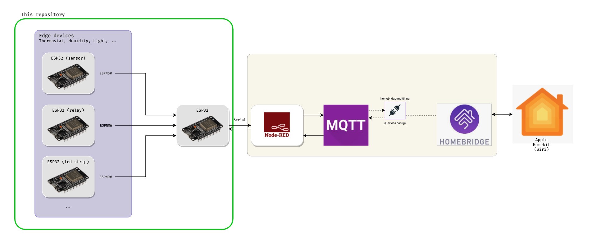

Home IoT with ESP32
===

I have this pluggable IoT environment at home that allows me to implement edge devices using ESP32/ESP8266 microcontrollers and bridges to smart home clients such as Siri -- via Homebridge.

This repository stores the code for edge devices as well as for the receiver that forwards messages to Serial (and then a nodered instance handles it)

More details about this architecture (TODO).

All communication happen using the ESPNow protocol.

# Modules

* Receiver - the ESPNow Access Point with which the edge devices will exchange messages;
* edge/leds12v - Edge device that controlls a RGBW/RGBWW led strip;
* edge/dht22 - Edge device that sends sensor information, in this case a DHT22 sensor;
* edge/relay_module - Edge device that controlls latching a relay;
* edge/office_led - Edge device that controlls an addressable led strip;
* shutter_motor - Edge device that controlls stepper motor for operating window shutters;
* 